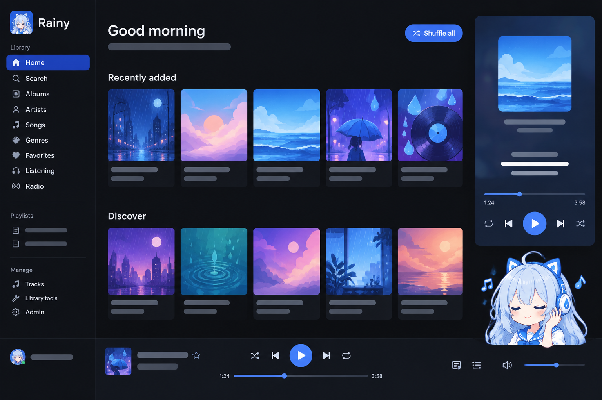

<p align="center">
  
</p>

<h1 align="center">Rainy</h1>

<p align="center">
  A self-hosted music server for your NAS, with a Subsonic API, an installable
  web player, and library management built in.
</p>

<p align="center">
  <a href="README.md">English</a> ·
  <a href="docs/readme/README.zh-Hans.md">简体中文</a> ·
  <a href="docs/readme/README.zh-Hant.md">繁體中文</a> ·
  <a href="docs/readme/README.ja.md">日本語</a>
</p>

<p align="center">
  <a href="https://github.com/yexca/rainy/releases"></a>
  <a href="https://hub.docker.com/r/yexca/rainy"></a>
  <a href="LICENSE"></a>
</p>

<p align="center">
  
</p>

Rainy turns the music folder on your NAS into a private streaming service, much
like [Navidrome](https://www.navidrome.org/). The difference is that library
management is a first-class feature: editing tags, replacing covers, adding
lyrics, renaming files by pattern, uploading, deleting, and finding broken
files all happen in the browser, without a desktop tagger.

Rainy is a single Go binary with an embedded React web app, shipped as one
Docker image for `linux/amd64` and `linux/arm64`.

> [!IMPORTANT]
> Rainy is under active development. Back up the data directory (`/config`) before
> an upgrade, and back up your music before enabling write access for tag
> editing. Review the [deployment security guide](docs/operations/security.md)
> before exposing an instance outside your home network.

## Key Features

- **Plays what you have.** MP3, FLAC, AAC/M4A/ALAC, Ogg Vorbis, Opus, WAV, AIFF,
  APE, WavPack, WMA, DSD (DSF/DFF), and more. Originals stream with seeking
  support; ffmpeg transcodes to MP3, Opus, or AAC on demand.
- **Works with your apps.** Subsonic API 1.16.1 plus OpenSubsonic extensions, so
  Symfonium, Amperfy, play:Sub, Feishin, Tempo, DSub, and many other clients
  connect directly. Password, token, and API-key authentication are supported.
- **A player worth installing.** The web app installs as a PWA and offers an
  iOS-style Now Playing screen, synced lyrics, a draggable queue, lock-screen
  controls through Media Session, AirPlay on iOS, light and dark themes, and
  English and Simplified Chinese.
- **Library management in the browser.** Single and batch tag editing with
  preview-before-apply tools, cover art, embedded or `.lrc` lyrics,
  rename/organize by pattern, uploads, optional downloads from YouTube and
  bilibili links through yt-dlp, optional online music search and downloads
  through lx-music compatible music sources, a restorable trash, a library
  doctor, and a complete edit history.
- **Friendly to CJK libraries.** Mojibake from legacy GBK, Big5, and Shift-JIS
  tags is repaired when reading and can be written back as UTF-8. Chinese artist
  names are indexed by pinyin initial.
- **Your listening, in numbers.** A personal listening report and play
  history, like Last.fm, with monthly and yearly recaps, and optional
  scrobbling to Last.fm and ListenBrainz from the web app and your Subsonic
  apps.
- **Music picked for you.** A daily mix and an infinite mode that keeps
  playing similar songs, chosen from your own library and plays on your
  server; nothing is sent anywhere.
- **Multi-user.** Administrator, manager, and listener roles with a separate
  download permission. Favorites, ratings, play counts, playlists, and the play
  queue are per user, and the queue follows you between the web app and
  Subsonic clients.

## Quick Start

You need a NAS or Linux host with Docker and the Compose plugin.

### 1. Prepare the deployment directory

Place [`docker-compose.yml`](docker-compose.yml) in an empty directory. Create a
`.env` file beside it that points Rainy at your music:

```dotenv
RAINY_MUSIC_PATH=/path/to/music
PUID=1000
PGID=1000
TZ=Asia/Shanghai
```

Set `PUID` and `PGID` to a user that can read your music folder, and write to it
if you want to edit tags, covers, or file names in Rainy. See
[Docker](docs/operations/docker.md#permissions-puid-and-pgid) for how to find
these values on Synology, QNAP, Unraid, TrueNAS SCALE, and OpenMediaVault.

[`.env.example`](.env.example) lists every optional setting: the image, data
path, host port, scan schedule, log level, proxy trust, and session lifetime.
See [Configuration](docs/operations/configuration.md) for details.

### 2. Start Rainy

```sh
docker compose up -d --pull always
docker compose logs -f rainy
```

Open `http://<host>:7650` and create the administrator account on the first
visit. Rainy adds `/data` as the first library and starts scanning.

`docker compose restart` reuses the current image and does not apply `.env`
changes. For reproducible deployments, set `RAINY_IMAGE` in `.env` to a reviewed
release tag or image digest and change it deliberately when upgrading. Existing
databases are migrated on startup.

The default port mapping listens on every host interface. Keep the instance on
a trusted network, or put it behind an HTTPS reverse proxy as described in
[Reverse proxy](docs/operations/reverse-proxy.md). HTTPS is also required to
install the web app as a PWA.

## Runtime Data

| Host path | Container path | Purpose | Back up? |
| --- | --- | --- | --- |
| `RAINY_DATA_PATH` (default `./config`) | `/config` | SQLite database, `secret.key`, cover cache, trash, upload staging, and yt-dlp with its encrypted cookies | Yes |
| `RAINY_MUSIC_PATH` (default `./data`) | `/data` | Your music library; writable when you use management features | Yes, with your NAS backup tools |

`secret.key` encrypts stored passwords. Losing it means every user must have
their password reset. Do not commit either directory: they contain account
data, listening history, and your media.

Existing installations using `/data` for application state and `/music` for
music must follow [the mount upgrade guide](docs/operations/docker.md#upgrading-the-mount-layout)
before switching to these defaults.

## User documentation

The [User Guide](docs/user/index.md) covers getting started, the library and
scanning, playback and the PWA, the listening report and scrobbling, library
management, and Subsonic clients. The [Operations
docs](docs/operations/index.md) cover Docker and NAS deployment,
configuration, reverse proxies, the database and backups, and troubleshooting.

## Documentation

| Goal | Start here |
| --- | --- |
| Use Rainy | [User Guide](docs/user/index.md) |
| Install and scan a first library | [Getting Started](docs/user/getting-started.md) |
| Connect a Subsonic app | [Clients](docs/user/clients.md) |
| Deploy on a NAS | [Docker](docs/operations/docker.md) |
| Configure and operate an instance | [Operations](docs/operations/index.md) · [Reliability](docs/operations/reliability.md) |
| Understand the system | [Architecture](docs/architecture/index.md) |
| Review design and security contracts | [Design](docs/development/design.md) · [Security](SECURITY.md) · [Privacy](PRIVACY.md) |
| Find every public document | [Documentation Index](docs/README.md) |

## Development and Contributing

Development setup, validation commands, migrations, and release procedures live
under `docs/development/` so this README can stay focused on installation and
use.

- [Local Development](docs/development/local-dev.md)
- [Development Guide](docs/development/index.md)
- [CI and Release Automation](docs/development/ci.md)
- [Testing](docs/development/testing.md)
- [Contributing](CONTRIBUTING.md)
- [Agent Guide](AGENTS.md)

## Security and Privacy

Library data and media require sign-in. Without an account, a client can reach
only the app shell, the health check, sign-in, and the first-run setup, which
closes once the first account exists. All file operations are confined to the
configured library roots. Rainy does not
send telemetry and makes no outbound requests of its own unless an
administrator enables the optional online metadata lookup, downloads from
YouTube and bilibili, online music, or scrobbling to Last.fm and
ListenBrainz. Report a suspected
vulnerability through the private process in [SECURITY.md](SECURITY.md), and
read [PRIVACY.md](PRIVACY.md) before sharing logs or diagnostics.

## Acknowledgements

Rainy builds on TagLib (through go-taglib, compiled to WebAssembly), FFmpeg,
SQLite (through modernc.org/sqlite), and, when enabled, yt-dlp. The Subsonic
and OpenSubsonic APIs make it work with the apps you already use, and
[Navidrome](https://www.navidrome.org/) showed how pleasant a self-hosted music
server can be.

## License

Copyright (C) 2026 yexca. Rainy is free software licensed under the
[GNU Affero General Public License v3.0](LICENSE) and comes without warranty.
